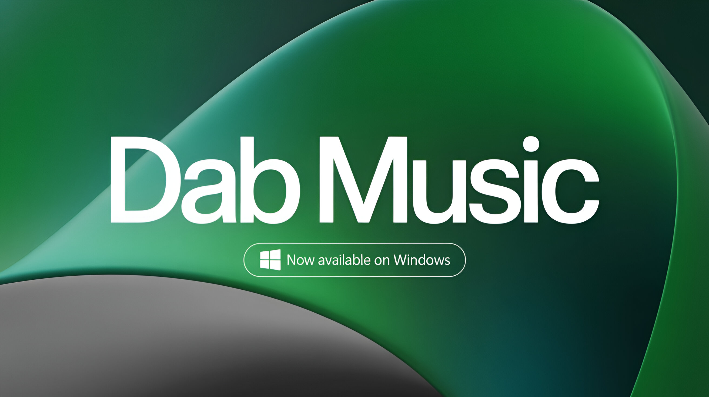

# DAB Music Player for Windows

  

  <strong>Premium High-Resolution Audio Streaming for Windows</strong>

  <em>Experience studio-quality audio with an elegant, modern interface</em>

---

## ✨ Overview

DAB Music Player is a premium desktop music streaming application designed for audiophiles and music enthusiasts who demand the highest audio quality. Built with a sophisticated native audio engine and a stunning glassmorphic interface, DAB delivers an unparalleled listening experience on Windows.

---

## 🎵 Audio Features

### High-Resolution Audio Support
- **24-bit / 192kHz** lossless audio streaming
- **16-bit / 44.1kHz** CD-quality playback
- **FLAC, WAV, AIFF** format support
- Real-time audio quality indicators (MAX badge for Hi-Res content)

### Professional Audio Engine
- Native audio processing via external audio manager library
- Ultra-low latency playback
- Gapless playback between tracks
- Hardware-accelerated audio decoding
- Direct audio path for bit-perfect output

### Advanced Audio Processing
- **10-Band Parametric Equalizer** with customizable presets
- **Real-time Audio Visualization** 
- **Volume Normalization** for consistent listening levels
- **Bass Enhancement** and audio effects
- **Tempo Control** without pitch distortion

### USB DAC & External Device Support
- Automatic detection of USB DACs
- Exclusive mode for dedicated audio devices
- ASIO-like low-latency output
- Support for high-impedance headphones

---

## 🎨 User Interface

### Glassmorphic Design
- Stunning frosted glass aesthetic
- Smooth animations and transitions
- Dark mode optimized for OLED displays
- Light mode (experimental) for daytime use

### Immersion Mode
- Full-screen album art experience
- Animated gradient backgrounds
- Minimalist controls that fade gracefully
- Perfect for ambient listening

### Modern Windows Integration
- Native Windows 11 design language
- System tray integration with media controls
- Windows notification support
- Keyboard shortcuts for quick control

---

## 🎧 Playback Features

### Queue Management
- Drag-and-drop queue reordering
- Add to queue from anywhere
- Clear queue or remove individual tracks
- Queue persistence across sessions

### Smart Playback
- Shuffle and repeat modes
- Crossfade between tracks
- Remember playback position
- Auto-resume on app restart

### Lyrics Support
- Real-time synchronized lyrics
- Lyrics fetching from multiple sources
- Manual lyrics search
- Elegant lyrics display overlay

---

## 📚 Library & Discovery

### Music Discovery
- Curated playlists and recommendations
- New releases and trending albums
- Genre-based exploration
- Artist radio and similar artists

### Artist Profiles
- Comprehensive artist biographies
- Complete discography browsing
- Related artists discovery
- High-resolution artist imagery

### Album Details
- Full track listings with duration
- Album credits and metadata
- Audio quality indicators per track
- One-click album playback

### Search
- Instant search across millions of tracks
- Filter by artists, albums, or tracks
- Search history for quick access
- Smart suggestions

---

## 💾 Offline & Downloads

### Download Manager
- Download albums and tracks for offline listening
- Multiple quality options (Standard, High, Maximum)
- Background downloading
- Download queue management

### Offline Mode
- Seamless offline playback
- Automatic sync when online
- Storage management tools
- Downloaded content organization

---

## ❤️ Personal Features

### Favorites
- Quick-add to favorites from any screen
- Favorites synchronization
- Organized favorites library
- Easy favorites management

### Playlists
- Create custom playlists
- Import playlists from Spotify
- Playlist sharing
- Smart playlist suggestions

### Library Management
- Personal music library
- Recently played history
- Most played tracks
- Custom collections

---

## ⌨️ Keyboard Shortcuts

| Shortcut | Action |
|----------|--------|
| `Space` | Play / Pause |
| `Ctrl + →` | Next Track |
| `Ctrl + ←` | Previous Track |
| `Ctrl + ↑` | Volume Up |
| `Ctrl + ↓` | Volume Down |
| `Ctrl + M` | Mute / Unmute |
| `Ctrl + L` | Toggle Favorite |
| `Ctrl + ,` | Open Settings |
| `F11` | Toggle Immersion Mode |
| `Escape` | Exit Immersion Mode |

*All shortcuts are fully customizable in Settings → Shortcuts*

---

## 🔧 System Requirements

### Minimum Requirements
- **OS:** Windows 10 (64-bit) version 1903 or later
- **Processor:** Intel Core i3 / AMD Ryzen 3 or equivalent
- **RAM:** 4 GB
- **Storage:** 200 MB for installation
- **Audio:** Any audio output device

### Recommended Requirements
- **OS:** Windows 11 (64-bit)
- **Processor:** Intel Core i5 / AMD Ryzen 5 or better
- **RAM:** 8 GB or more
- **Storage:** SSD recommended for faster loading
- **Audio:** USB DAC or high-quality sound card

---

## 📦 Installation

### Using the Installer
1. Download the latest `DAB_Music_Setup.exe` from releases
2. Run the installer and follow the prompts
3. Choose installation directory (default: `C:\Program Files\DAB Music`)
4. Launch DAB Music from the Start Menu or Desktop shortcut

### Portable Version
1. Download the portable ZIP from releases
2. Extract to your preferred location
3. Run `dab.exe` directly
4. No installation required

---

## 🔐 Account & Sync

- Secure account authentication
- Cross-device synchronization
- Favorites and playlists sync
- Listening history sync
- Secure token-based authentication

---

## ⚙️ Settings & Customization

### Appearance
- Dark / Light theme toggle
- Immersion mode preferences
- Animation settings
- Accent color customization

### Playback
- Default audio quality selection
- Crossfade duration
- Gapless playback toggle
- Volume normalization

### Downloads
- Download quality preferences
- Storage location
- Automatic download settings
- Cache management

### Audio Output
- Output device selection
- Exclusive mode toggle
- Sample rate configuration
- Buffer size adjustment

---

## 🛠️ Troubleshooting

### Audio Issues
- Ensure audio drivers are up to date
- Check output device selection in Settings
- Disable exclusive mode if experiencing conflicts
- Restart the application after changing audio devices

### Performance
- Close unnecessary background applications
- Ensure Windows is updated
- Clear application cache in Settings
- Check available storage space

### Network
- Verify internet connection
- Check firewall settings
- Try disabling VPN if streaming issues occur
- Clear DNS cache if connection problems persist

---

## 📝 Version History

### v2.9.5 (Latest)
- New Windows-native UI with glassmorphic design
- Immersion mode for full-screen experience
- Enhanced keyboard shortcuts
- Improved audio quality indicators
- Performance optimizations

### v2.9.0
- Initial Windows release
- High-resolution audio support
- Native audio engine integration
- System tray support

---

## 💖 Support Development

DAB Music Player is developed with passion for music and audio quality. If you enjoy the app, consider supporting its development:

- ⭐ Star the project
- 🐛 Report bugs and issues
- 💡 Suggest new features
- ☕ Buy the developer a coffee

---

## 📄 License

DAB Music Player uses external audio processing libraries for high-quality audio playback. Please refer to the respective library documentation for licensing details.

---

  <strong>Made with ❤️ for music lovers</strong>

  <em>© 2024-2026 DAB Music Player. All rights reserved.</em>

